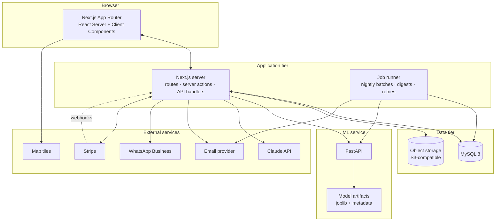

# 02 — Technical Architecture

## 1. System overview



The web application is the only thing that talks to the database. The ML service is stateless and knows nothing about MySQL: it receives a feature payload and returns numbers. That boundary is deliberate — it keeps model iteration independent of application deployment, and it means an ML outage degrades two features instead of taking the site down.

## 2. Stack decisions

### Web application — Next.js (TypeScript, App Router)

**Why.** The public side lives or dies on SEO: thousands of animal profile pages need to be server-rendered, indexable, and fast. The shelter side needs rich interactivity. Next.js is the one framework that does both well without maintaining two applications, and its i18n routing gives us bilingual URLs without extra machinery.

**Rejected.** A Python-only stack (FastAPI + Jinja/HTMX) would have unified the language, but the shelter dashboard, the multi-step quiz, the visit calendar and the assistant widget are genuinely interactive, and rebuilding that experience in server-rendered fragments costs more than the polyglot tax. A React SPA on a JSON API loses SSR and SEO — fatal for the public half. Exporting the trained forest to run in Node was considered and dropped: it would freeze feature engineering into JavaScript and make retraining an export ceremony instead of a job.

### ORM — Prisma

Typed schema shared with application code, readable migrations, honest relation modelling. Its weaknesses (complex aggregate queries, geospatial predicates) are handled by dropping to raw SQL for the two or three places that need it — distance search and dashboard aggregates — which is a fair trade.

### Database — MySQL 8

Fixed by the brief. Version 8 specifically, for CTEs, window functions, functional indexes and native JSON with generated columns. InnoDB, `utf8mb4_0900_ai_ci` collation so Italian accented search behaves.

### ML service — Python + FastAPI + scikit-learn

Random Forest is the specified baseline, compared against logistic/linear regression as required by the brief and against gradient boosting as a stretch. FastAPI gives typed request/response models and an OpenAPI schema the web app can generate a client from. Model artifacts are versioned files loaded at startup, not pickles fetched at request time.

### UI — Tailwind + shadcn/ui with a custom theme

shadcn components are copied into the repository and restyled with our own tokens, so we inherit Radix's accessibility work without inheriting the default look. Details in [07 — Design System](./07-design-system.md).

### Background jobs — a job table, not a broker

Nightly prediction batches, match digests, email retries and media derivative generation run through a `jobs` table polled by a small worker process in the same container image as the web app. A message broker is the correct answer at scale and the wrong answer for a platform serving dozens of shelters: it doubles the operational surface for work that is measured in hundreds of rows per night. Revisit if job volume passes ~10k/day.

### Authentication — Auth.js (NextAuth) with a credentials provider

Email and password, Argon2id hashing, database sessions (not JWTs) so that suspension and logout take effect immediately. Sessions are httpOnly, secure, SameSite=Lax cookies with a 30-day sliding expiry. Optional Google sign-in is a phase-5 nicety, not a dependency.

## 3. Repository layout

```
pet-match-ai/
├── apps/
│   └── web/                     # Next.js application
│       ├── app/
│       │   ├── [locale]/        # public + adopter + shelter routes
│       │   ├── admin/           # platform admin
│       │   └── api/             # route handlers, webhooks
│       ├── components/          # ui/ (shadcn-derived) + feature components
│       ├── lib/
│       │   ├── db/              # prisma client, raw-SQL helpers
│       │   ├── auth/            # session, guards, permissions
│       │   ├── matching/        # scoring engine (pure functions)
│       │   ├── ml/              # typed client for the ML service
│       │   ├── ai/              # Claude client, prompts, tools, RAG
│       │   ├── media/           # upload, validation, derivatives
│       │   ├── geo/             # comune lookup, distance
│       │   ├── notifications/   # channels, templates, dispatch
│       │   └── jobs/            # job definitions + runner
│       ├── messages/            # it.json, en.json
│       ├── prisma/              # schema.prisma, migrations, seed
│       └── tests/               # unit, integration, e2e
├── services/
│   └── ml/
│       ├── api/                 # FastAPI app, schemas, routes
│       ├── training/            # ETL, features, train, evaluate
│       ├── models/              # versioned artifacts (git-ignored)
│       └── tests/
├── packages/
│   └── shared/                  # enums, types, constants shared web ↔ docs
├── data/                        # raw datasets (git-ignored), comuni lookup
├── docker/                      # Dockerfiles, compose, init SQL
└── docs/                        # these documents
```

The matching engine is deliberately a set of pure functions with no I/O: it takes an adopter profile and an animal, and returns a score with a breakdown. That makes it exhaustively unit-testable and keeps the scoring rules readable by a non-programmer reviewing them against [06](./06-matching-algorithm.md).

## 4. Authentication and authorisation

### Session flow

1. Credentials verified against `users.password_hash` (Argon2id).
2. A session row is created; the cookie carries only an opaque token.
3. Every request resolves the session to a `SessionUser`: `{ id, role, locale, shelterIds[] }`.
4. Route groups are guarded by layout-level checks; every data access is additionally guarded at the query layer.

### Authorisation model

Two layers, both mandatory. Route guards are for user experience — they redirect people away from pages they cannot use. Query guards are for security.

```ts
// Every shelter-scoped query goes through a guard that resolves the
// caller's membership before it touches data. There is no code path
// that accepts a shelter_id from the client and trusts it.
async function requireShelterAccess(user: SessionUser, shelterId: string) {
  if (user.role === 'platform_admin') return auditedReadOnly(shelterId)
  if (!user.shelterIds.includes(shelterId)) throw new ForbiddenError()
  return full(shelterId)
}
```

Rules that hold everywhere:
- A shelter id is never accepted from a request body or query string as the authority for access; it is resolved from the session's memberships, and any client-supplied value is checked against them.
- Platform admin reads across tenants are read-only and audit-logged. Admins cannot decide applications, edit animals, or impersonate users.
- Medical records, application internal notes, and adopter contact details are never included in any public or cross-tenant serialiser. This is enforced by explicit `select` lists — no `SELECT *` reaches a response.

### Permission matrix

The authoritative matrix is §7 of [01 — Product Specification](./01-product-spec.md); it is implemented as a single table of `(role, action, scope)` tuples in `lib/auth/permissions.ts` so the document and the code can be diffed against each other.

## 5. Multi-tenancy

Row-level tenancy on a shared schema. Every shelter-owned table carries `shelter_id` with an index, and animals carry it directly rather than being reached through a join, so the hot public query filters cheaply.

- **Public reads** are cross-tenant by design (adopters search all shelters) and are restricted to a published-safe projection: `status IN ('available','reserved')` and shelter `status = 'active'`.
- **Shelter reads and all writes** are scoped by membership.
- **Deleting a shelter** never hard-deletes animals with outcomes; the shelter is archived and its listings de-published, because adoption history is the platform's memory and other people's applications reference it.

## 6. Internationalisation

- **Routing.** `/[locale]/...` with `it` as default and `en` alongside. Locale is detected from the path, then a cookie, then `Accept-Language`. `hreflang` alternates on every public page; canonical URLs per locale.
- **UI strings.** `next-intl` with `messages/it.json` and `messages/en.json`. Keys are namespaced by feature. A missing key fails the build in CI rather than silently rendering the key.
- **Database content.** Shelter-authored text has explicit per-language columns (`story_it`, `story_en`, `description_it`, …). When one is empty the UI renders the other with a visible "in inglese" / "in Italian" label — never machine-translates silently.
- **Slugs.** Animal and shelter slugs are generated once from Italian content and are stable across locales; renaming an animal does not break links (old slugs redirect).
- **Formatting.** Dates, numbers and distances use `Intl`; the display timezone is `Europe/Rome` while storage is UTC.
- **Outbound messages.** Emails, WhatsApp templates and notifications are rendered in the recipient's `users.locale`.
- **Assistant.** Replies in the conversation's locale; retrieval prefers knowledge-base documents in that locale and falls back to the other, translating in-flight rather than quoting a foreign-language source.

## 7. Media pipeline

```
client → validate (type, size, dimensions) → direct upload to storage
       → server records animal_media row
       → job generates derivatives → row updated with derivative keys
```

- **Storage.** S3-compatible. Local development uses MinIO in Compose; production can be any provider. All access goes through a thin storage adapter so the provider is a configuration detail.
- **Keys.** `shelters/{shelterId}/animals/{animalId}/{mediaId}/{variant}.{ext}` — never user-supplied filenames.
- **Photos.** Accepted: JPEG, PNG, WebP, HEIC. Max 12 MB. Derivatives at 320 / 640 / 1280 / 1920 px in WebP and AVIF, plus a blurred placeholder stored inline for instant paint. EXIF stripped except orientation, which is applied then discarded — camera GPS coordinates must not survive upload.
- **Video.** Accepted: MP4 (H.264/AAC), MOV. Max 60 s, max 100 MB. Transcoded to a 720p MP4 and a poster frame. Videos never autoplay with sound and always have a poster.
- **Serving.** Public URLs for published media; private media (medical attachments) served through signed, short-lived URLs behind an authorisation check.
- **Deletion.** Removing media soft-deletes the row immediately and enqueues object deletion, so an accidental delete is recoverable for 30 days.
- **Fallback.** Animals without a photo render a species-appropriate illustrated placeholder, and publication is blocked until at least one real photo exists.

## 8. Geography and distance

Italy has ~7,900 comuni. Rather than depend on a geocoding API for every search, the platform ships a bundled lookup table (ISTAT code, name, province, region, CAPs, centroid coordinates) seeded from public open data.

- **Shelters** are geocoded once at registration — lookup by comune first, external geocoder only as a fallback for a precise street address, coordinates stored on the row and editable by dragging a map pin in settings.
- **Adopters** provide a comune or CAP (or grant browser geolocation, which is never stored without consent) and a radius.
- **Distance search** uses a bounding-box prefilter on indexed `latitude`/`longitude` followed by a haversine computation, ordered and limited in SQL. At Italian scale this is a millisecond-class query and requires no spatial extension:

```sql
SELECT a.id,
       6371 * 2 * ASIN(SQRT(
         POW(SIN(RADIANS(s.latitude - :lat) / 2), 2) +
         COS(RADIANS(:lat)) * COS(RADIANS(s.latitude)) *
         POW(SIN(RADIANS(s.longitude - :lng) / 2), 2)
       )) AS distance_km
FROM animals a
JOIN shelters s ON s.id = a.shelter_id
WHERE a.status IN ('available', 'reserved')
  AND s.status = 'active'
  AND s.latitude  BETWEEN :latMin AND :latMax
  AND s.longitude BETWEEN :lngMin AND :lngMax
HAVING distance_km <= :radiusKm
ORDER BY distance_km
LIMIT :limit OFFSET :offset;
```

- **Maps.** Leaflet with OpenStreetMap tiles by default (no key, no vendor account, attribution respected), behind an adapter so tiles can be swapped for a commercial provider later. Markers cluster; the map never loads on a route where it is not visible.

## 9. AI integration

- **Model.** Claude, called server-side only. No API key ever reaches the browser; every conversation passes through our own route handler.
- **Retrieval.** Knowledge-base articles are chunked, embedded, and stored in `kb_chunks`. At the platform's document volume (low hundreds), retrieval is an in-process cosine similarity over embeddings loaded into memory and refreshed on publish — a vector database is unjustified complexity here, and the interface is written so one can be substituted without touching call sites.
- **Tools.** The assistant is given a small, explicitly enumerated tool set per persona (see [04 — API Contracts](./04-api-contracts.md) §7). Tools are server-executed with the caller's own authorisation; the adopter persona has no tool that can reach a specific shelter's private data, and the staff persona's tools are hard-scoped to the caller's `shelter_id` — the model cannot pass a different one, because it is injected server-side and not a model-visible parameter.
- **Prompt-injection posture.** Shelter-authored text and knowledge-base content are treated as data, never as instructions. Retrieved content is delimited and the system prompt states that content inside those delimiters is reference material only. The assistant has no write tools at all, which removes the entire class of "convince the model to change a record" attacks.
- **Cost control.** Per-session and per-IP rate limits; a monthly platform budget with alerting; token usage recorded per conversation in `conversations`; prompt caching for the static system prompt and knowledge-base preamble; the staff assistant additionally metered against the shelter's plan quota.
- **Degradation.** With no API key configured, the widget renders a static FAQ with a clear notice instead of failing.

## 10. Environment configuration

| Variable | Purpose | Dev fallback if unset |
|---|---|---|
| `DATABASE_URL` | MySQL connection | Compose default — required |
| `AUTH_SECRET` | Session/cookie signing | Generated dev value with a loud warning |
| `APP_URL` | Canonical base URL | `http://localhost:3000` |
| `ML_SERVICE_URL` | FastAPI base URL | `http://localhost:8000`; if unreachable, heuristic fallback |
| `ML_SERVICE_TOKEN` | Shared secret for the ML service | Disabled in dev |
| `ANTHROPIC_API_KEY` | Claude | Assistant returns a canned response, labelled |
| `S3_ENDPOINT` / `S3_BUCKET` / `S3_ACCESS_KEY` / `S3_SECRET_KEY` | Object storage | MinIO in Compose |
| `EMAIL_PROVIDER_KEY` | Transactional email | Written to `.dev-mailbox/` as `.eml` files |
| `EMAIL_FROM` | Sender identity | `noreply@localhost` |
| `WHATSAPP_PHONE_ID` / `WHATSAPP_TOKEN` | WhatsApp Business | Logged to console |
| `STRIPE_SECRET_KEY` / `STRIPE_WEBHOOK_SECRET` | Payments | Billing UI shows a "not configured" state |
| `GEOCODER_URL` | Street-level geocoding fallback | Comune centroid only |
| `MAP_TILE_URL` | Tile server | OpenStreetMap default |
| `SENTRY_DSN` | Error reporting | Disabled |
| `RATE_LIMIT_*` | Assistant and auth throttles | Permissive dev defaults |

A single `env.check.ts` runs at boot, validates the shape of everything present, prints a table of which integrations are live versus stubbed, and refuses to start in production if a production-required variable is missing.

## 11. Local development

```yaml
# docker/compose.yml — topology, not final syntax
services:
  db:      # mysql:8, seeded from docker/init/*.sql, volume-persisted
  minio:   # S3-compatible storage + bucket bootstrap
  ml:      # services/ml, reload on change, mounts models/
  web:     # apps/web, next dev, depends_on db + minio
  mailhog: # captures dev email, browsable UI
```

`docker compose up` must yield a working, seeded application with demo shelters, demo animals with photos, and demo accounts for each role — with no external credentials configured. That is a hard requirement, not a convenience: it is what makes the phased delivery reviewable.

## 12. Cross-cutting conventions

- **Errors.** A single error envelope across all API responses (see [04](./04-api-contracts.md) §2). Server errors are logged with a correlation id that is also surfaced in the UI's error state, so a user can quote it in a support message.
- **Logging.** Structured JSON: timestamp, level, correlation id, user id, shelter id, route, duration. Never log personal data, adopter contact details, medical text, or assistant message content — only counts and token totals.
- **Rate limiting.** Sliding window per IP and per session on authentication, application submission, assistant messages, and media upload.
- **Validation.** Zod schemas shared between client and server; the server never trusts a client-side validation result.
- **Caching.** Public animal pages are statically rendered with on-demand revalidation when the record changes; search results are dynamic; the comune lookup and knowledge-base embeddings are process-cached.
- **Idempotency.** Application submission, booking, and Stripe webhooks are idempotent by key so a double-click or a retried webhook cannot produce duplicates.
- **Testing.** Unit for the scoring engine and ML feature transforms; integration for API routes against a real MySQL in CI; end-to-end (Playwright) for the three journeys that matter — browse → match → apply, shelter creates and publishes an animal, application → approval → visit booked. Strategy detail in [08](./08-roadmap.md).
