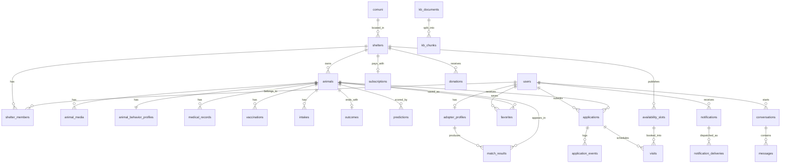

# 03 — Database Schema

MySQL 8, InnoDB, `utf8mb4` / `utf8mb4_0900_ai_ci` (accent- and case-insensitive, so *Rufus* and *rufus* and *perché* behave in search).

**Identifier convention.** Business entities use `CHAR(26)` ULIDs — sortable by creation time, not enumerable in a URL, and safe to generate application-side before insert. High-volume append-only tables (events, audit, notifications, messages) use `BIGINT UNSIGNED AUTO_INCREMENT`, where enumeration is not a concern and index size is.

**Timestamp convention.** All `DATETIME(3)` in UTC. `created_at` defaults to `CURRENT_TIMESTAMP(3)`; `updated_at` additionally `ON UPDATE`. Calendar-only values (birth dates, intake dates, medical event dates) are `DATE`, because a timezone on "born in March" is a lie.

**Money convention.** `INT UNSIGNED` cents, EUR.

**Soft deletion.** Only where history matters: `users`, `animals`, `animal_media`, `shelters`. Everything else deletes for real.

## 1. Entity relationships



## 2. Reference data

```sql
CREATE TABLE comuni (
  id            SMALLINT UNSIGNED NOT NULL AUTO_INCREMENT,
  istat_code    CHAR(6)      NOT NULL,
  name          VARCHAR(120) NOT NULL,
  province_code CHAR(2)      NOT NULL,   -- MI, RM, TO …
  region        VARCHAR(40)  NOT NULL,   -- Lombardia, Lazio …
  postal_codes  JSON         NOT NULL,   -- ["20121","20122", …]
  latitude      DECIMAL(9,6) NOT NULL,   -- centroid
  longitude     DECIMAL(9,6) NOT NULL,
  PRIMARY KEY (id),
  UNIQUE KEY uq_comuni_istat (istat_code),
  KEY idx_comuni_name (name),
  KEY idx_comuni_province (province_code),
  KEY idx_comuni_coords (latitude, longitude)
) ENGINE=InnoDB;
```

Seeded from public ISTAT open data at build time. Postal-code lookup uses a generated search index over the JSON column; a comune may have many CAPs and a CAP may span comuni, which is why neither is a key.

## 3. Identity

```sql
CREATE TABLE users (
  id                 CHAR(26)     NOT NULL,
  email              VARCHAR(255) NOT NULL,
  email_verified_at  DATETIME(3)  NULL,
  password_hash      VARCHAR(255) NULL,        -- NULL for OAuth-only accounts
  full_name          VARCHAR(160) NOT NULL,
  phone              VARCHAR(32)  NULL,
  locale             ENUM('it','en') NOT NULL DEFAULT 'it',
  role               ENUM('adopter','shelter_staff','platform_admin') NOT NULL DEFAULT 'adopter',
  status             ENUM('active','suspended','deleted') NOT NULL DEFAULT 'active',
  marketing_opt_in   TINYINT(1)   NOT NULL DEFAULT 0,
  last_login_at      DATETIME(3)  NULL,
  created_at         DATETIME(3)  NOT NULL DEFAULT CURRENT_TIMESTAMP(3),
  updated_at         DATETIME(3)  NOT NULL DEFAULT CURRENT_TIMESTAMP(3) ON UPDATE CURRENT_TIMESTAMP(3),
  deleted_at         DATETIME(3)  NULL,
  PRIMARY KEY (id),
  UNIQUE KEY uq_users_email (email),
  KEY idx_users_role_status (role, status)
) ENGINE=InnoDB;

CREATE TABLE sessions (
  id            CHAR(26)     NOT NULL,
  user_id       CHAR(26)     NOT NULL,
  token_hash    CHAR(64)     NOT NULL,          -- SHA-256 of the cookie value
  expires_at    DATETIME(3)  NOT NULL,
  ip_hash       CHAR(64)     NULL,
  user_agent    VARCHAR(255) NULL,
  created_at    DATETIME(3)  NOT NULL DEFAULT CURRENT_TIMESTAMP(3),
  PRIMARY KEY (id),
  UNIQUE KEY uq_sessions_token (token_hash),
  KEY idx_sessions_user (user_id),
  KEY idx_sessions_expiry (expires_at),
  CONSTRAINT fk_sessions_user FOREIGN KEY (user_id) REFERENCES users(id) ON DELETE CASCADE
) ENGINE=InnoDB;

CREATE TABLE verification_tokens (
  id          CHAR(26)    NOT NULL,
  user_id     CHAR(26)    NULL,                 -- NULL for invitations to unregistered emails
  email       VARCHAR(255) NOT NULL,
  purpose     ENUM('email_verify','password_reset','shelter_invite') NOT NULL,
  token_hash  CHAR(64)    NOT NULL,
  payload     JSON        NULL,                 -- e.g. {"shelter_id":"…"}
  expires_at  DATETIME(3) NOT NULL,
  consumed_at DATETIME(3) NULL,
  created_at  DATETIME(3) NOT NULL DEFAULT CURRENT_TIMESTAMP(3),
  PRIMARY KEY (id),
  UNIQUE KEY uq_verification_token (token_hash),
  KEY idx_verification_email_purpose (email, purpose)
) ENGINE=InnoDB;
```

## 4. Shelters

```sql
CREATE TABLE shelters (
  id                CHAR(26)     NOT NULL,
  slug              VARCHAR(140) NOT NULL,
  name              VARCHAR(160) NOT NULL,
  legal_name        VARCHAR(200) NULL,
  type              ENUM('canile_comunale','canile_privato','gattile','associazione','rifugio') NOT NULL,
  tax_id            VARCHAR(20)  NULL,          -- P.IVA or codice fiscale
  email             VARCHAR(255) NOT NULL,
  phone             VARCHAR(32)  NULL,
  whatsapp_phone    VARCHAR(32)  NULL,
  website           VARCHAR(255) NULL,
  social_links      JSON         NULL,
  address_line      VARCHAR(255) NOT NULL,
  comune_id         SMALLINT UNSIGNED NOT NULL,
  postal_code       CHAR(5)      NOT NULL,
  latitude          DECIMAL(9,6) NULL,
  longitude         DECIMAL(9,6) NULL,
  description_it    TEXT         NULL,
  description_en    TEXT         NULL,
  opening_hours     JSON         NULL,          -- [{"day":1,"open":"09:00","close":"12:30"}, …]
  logo_key          VARCHAR(255) NULL,
  cover_key         VARCHAR(255) NULL,
  capacity_dogs     SMALLINT UNSIGNED NULL,
  capacity_cats     SMALLINT UNSIGNED NULL,
  status            ENUM('pending','active','suspended','archived') NOT NULL DEFAULT 'pending',
  plan              ENUM('free','base','pro') NOT NULL DEFAULT 'free',
  booking_cutoff_hours SMALLINT UNSIGNED NOT NULL DEFAULT 24,
  accepts_donations TINYINT(1)   NOT NULL DEFAULT 0,
  approved_at       DATETIME(3)  NULL,
  approved_by       CHAR(26)     NULL,
  rejection_reason  TEXT         NULL,
  created_at        DATETIME(3)  NOT NULL DEFAULT CURRENT_TIMESTAMP(3),
  updated_at        DATETIME(3)  NOT NULL DEFAULT CURRENT_TIMESTAMP(3) ON UPDATE CURRENT_TIMESTAMP(3),
  deleted_at        DATETIME(3)  NULL,
  PRIMARY KEY (id),
  UNIQUE KEY uq_shelters_slug (slug),
  KEY idx_shelters_status (status),
  KEY idx_shelters_coords (latitude, longitude),
  KEY idx_shelters_comune (comune_id),
  CONSTRAINT fk_shelters_comune FOREIGN KEY (comune_id) REFERENCES comuni(id)
) ENGINE=InnoDB;

CREATE TABLE shelter_members (
  id                  CHAR(26)    NOT NULL,
  shelter_id          CHAR(26)    NOT NULL,
  user_id             CHAR(26)    NOT NULL,
  is_billing_contact  TINYINT(1)  NOT NULL DEFAULT 0,  -- receives invoices; no extra permissions
  invited_by          CHAR(26)    NULL,
  joined_at           DATETIME(3) NOT NULL DEFAULT CURRENT_TIMESTAMP(3),
  PRIMARY KEY (id),
  UNIQUE KEY uq_member (shelter_id, user_id),
  KEY idx_member_user (user_id),
  CONSTRAINT fk_member_shelter FOREIGN KEY (shelter_id) REFERENCES shelters(id) ON DELETE CASCADE,
  CONSTRAINT fk_member_user FOREIGN KEY (user_id) REFERENCES users(id) ON DELETE CASCADE
) ENGINE=InnoDB;
```

## 5. Animals

```sql
CREATE TABLE animals (
  id                     CHAR(26)     NOT NULL,
  shelter_id             CHAR(26)     NOT NULL,
  slug                   VARCHAR(160) NOT NULL,
  internal_code          VARCHAR(40)  NULL,       -- the shelter's own reference
  name                   VARCHAR(80)  NOT NULL,
  species                ENUM('dog','cat') NOT NULL,
  sex                    ENUM('male','female','unknown') NOT NULL DEFAULT 'unknown',
  size                   ENUM('small','medium','large','xlarge') NULL,   -- required to publish
  breed_primary          VARCHAR(80)  NULL,
  breed_secondary        VARCHAR(80)  NULL,
  is_mixed               TINYINT(1)   NOT NULL DEFAULT 1,
  coat_color             VARCHAR(60)  NULL,
  coat_length            ENUM('short','medium','long') NULL,
  birth_date             DATE         NULL,
  birth_date_estimated   TINYINT(1)   NOT NULL DEFAULT 1,
  weight_kg              DECIMAL(5,2) NULL,
  microchip_number       CHAR(15)     NULL,
  microchip_registered_on DATE        NULL,
  anagrafe_region        VARCHAR(40)  NULL,       -- regional registry the chip is filed with
  is_sterilized          TINYINT(1)   NULL,       -- NULL = unknown
  sterilized_on          DATE         NULL,
  has_special_needs      TINYINT(1)   NOT NULL DEFAULT 0,
  special_needs_summary  VARCHAR(255) NULL,       -- public-safe, shelter-authored
  is_vaccinated_summary  TINYINT(1)   NULL,       -- public-safe roll-up
  headline_it            VARCHAR(140) NULL,
  headline_en            VARCHAR(140) NULL,
  story_it               TEXT         NULL,
  story_en               TEXT         NULL,
  adoption_fee_cents     INT UNSIGNED NULL,
  status                 ENUM('draft','available','reserved','adopted','unavailable','transferred','deceased')
                           NOT NULL DEFAULT 'draft',
  unavailable_reason     ENUM('medical_hold','quarantine','behavioral_rehab','foster','other') NULL,
  intake_date            DATE         NOT NULL,
  published_at           DATETIME(3)  NULL,
  adopted_at             DATETIME(3)  NULL,
  created_by             CHAR(26)     NULL,
  created_at             DATETIME(3)  NOT NULL DEFAULT CURRENT_TIMESTAMP(3),
  updated_at             DATETIME(3)  NOT NULL DEFAULT CURRENT_TIMESTAMP(3) ON UPDATE CURRENT_TIMESTAMP(3),
  deleted_at             DATETIME(3)  NULL,
  PRIMARY KEY (id),
  UNIQUE KEY uq_animals_slug (slug),
  UNIQUE KEY uq_animals_microchip (microchip_number),
  KEY idx_animals_shelter_status (shelter_id, status),
  KEY idx_animals_public (status, species, published_at),
  KEY idx_animals_intake (intake_date),
  FULLTEXT KEY ft_animals_text (name, breed_primary, story_it, story_en),
  CONSTRAINT fk_animals_shelter FOREIGN KEY (shelter_id) REFERENCES shelters(id)
) ENGINE=InnoDB;
```

`idx_animals_public` is the index the public catalogue leans on. The unique microchip constraint is platform-wide on purpose: the same chip appearing under two shelters means a transfer was mishandled, and the conflict should be visible rather than silently duplicated.

```sql
CREATE TABLE animal_media (
  id              CHAR(26)     NOT NULL,
  animal_id       CHAR(26)     NOT NULL,
  kind            ENUM('photo','video') NOT NULL,
  storage_key     VARCHAR(255) NOT NULL,
  derivatives     JSON         NULL,        -- {"320":"…webp","640":"…webp","poster":"…jpg"}
  placeholder     VARCHAR(512) NULL,        -- inline blur data URI
  mime_type       VARCHAR(80)  NOT NULL,
  width           SMALLINT UNSIGNED NULL,
  height          SMALLINT UNSIGNED NULL,
  duration_seconds SMALLINT UNSIGNED NULL,
  byte_size       INT UNSIGNED NOT NULL,
  alt_text_it     VARCHAR(255) NULL,
  alt_text_en     VARCHAR(255) NULL,
  is_primary      TINYINT(1)   NOT NULL DEFAULT 0,
  sort_order      SMALLINT UNSIGNED NOT NULL DEFAULT 0,
  processing_status ENUM('pending','ready','failed') NOT NULL DEFAULT 'pending',
  created_at      DATETIME(3)  NOT NULL DEFAULT CURRENT_TIMESTAMP(3),
  deleted_at      DATETIME(3)  NULL,
  PRIMARY KEY (id),
  KEY idx_media_animal (animal_id, sort_order),
  CONSTRAINT fk_media_animal FOREIGN KEY (animal_id) REFERENCES animals(id) ON DELETE CASCADE
) ENGINE=InnoDB;

CREATE TABLE animal_behavior_profiles (
  animal_id             CHAR(26) NOT NULL,
  energy_level          TINYINT UNSIGNED NULL,   -- 1 very calm … 5 very high
  sociability_people    TINYINT UNSIGNED NULL,   -- 1 shy … 5 outgoing
  good_with_children    ENUM('yes','older_only','no','unknown') NOT NULL DEFAULT 'unknown',
  good_with_dogs        ENUM('yes','selective','no','unknown') NOT NULL DEFAULT 'unknown',
  good_with_cats        ENUM('yes','selective','no','unknown') NOT NULL DEFAULT 'unknown',
  house_trained         ENUM('yes','partially','no','unknown') NOT NULL DEFAULT 'unknown',
  leash_trained         ENUM('yes','partially','no','unknown') NOT NULL DEFAULT 'unknown',
  noise_tolerance       TINYINT UNSIGNED NULL,   -- 1 needs quiet … 5 unbothered
  alone_tolerance_hours TINYINT UNSIGNED NULL,   -- max hours comfortably alone
  training_needs        TINYINT UNSIGNED NULL,   -- 1 none … 5 substantial
  grooming_needs        TINYINT UNSIGNED NULL,   -- 1 minimal … 5 daily
  exercise_min_per_day  SMALLINT UNSIGNED NULL,
  suitable_for_first_time ENUM('yes','no','unknown') NOT NULL DEFAULT 'unknown',
  needs_garden          ENUM('yes','preferred','no','unknown') NOT NULL DEFAULT 'unknown',
  temperament_tags      JSON NULL,               -- ["affettuoso","curioso","timido"]
  notes_it              TEXT NULL,
  notes_en              TEXT NULL,
  assessed_by           CHAR(26) NULL,
  assessed_at           DATETIME(3) NULL,
  updated_at            DATETIME(3) NOT NULL DEFAULT CURRENT_TIMESTAMP(3) ON UPDATE CURRENT_TIMESTAMP(3),
  PRIMARY KEY (animal_id),
  CONSTRAINT fk_behavior_animal FOREIGN KEY (animal_id) REFERENCES animals(id) ON DELETE CASCADE
) ENGINE=InnoDB;
```

`unknown` is a first-class value on every compatibility field. Matching treats it as uncertainty and says so, rather than assuming the optimistic answer — that assumption is exactly what produces returned adoptions.

## 6. Health

```sql
CREATE TABLE medical_records (
  id            BIGINT UNSIGNED NOT NULL AUTO_INCREMENT,
  animal_id     CHAR(26)     NOT NULL,
  record_type   ENUM('exam','treatment','surgery','test','deworming','weight','other') NOT NULL,
  occurred_on   DATE         NOT NULL,
  title         VARCHAR(160) NOT NULL,
  description   TEXT         NULL,
  vet_name      VARCHAR(120) NULL,
  clinic_name   VARCHAR(160) NULL,
  cost_cents    INT UNSIGNED NULL,
  weight_kg     DECIMAL(5,2) NULL,
  next_due_on   DATE         NULL,
  attachment_key VARCHAR(255) NULL,          -- private, signed-URL access only
  created_by    CHAR(26)     NULL,
  created_at    DATETIME(3)  NOT NULL DEFAULT CURRENT_TIMESTAMP(3),
  PRIMARY KEY (id),
  KEY idx_medical_animal_date (animal_id, occurred_on),
  KEY idx_medical_due (next_due_on),
  CONSTRAINT fk_medical_animal FOREIGN KEY (animal_id) REFERENCES animals(id) ON DELETE CASCADE
) ENGINE=InnoDB;

CREATE TABLE vaccinations (
  id              BIGINT UNSIGNED NOT NULL AUTO_INCREMENT,
  animal_id       CHAR(26)    NOT NULL,
  vaccine_type    VARCHAR(80) NOT NULL,     -- rabbia, trivalente, FeLV …
  administered_on DATE        NOT NULL,
  valid_until     DATE        NULL,
  batch_number    VARCHAR(60) NULL,
  vet_name        VARCHAR(120) NULL,
  created_by      CHAR(26)    NULL,
  created_at      DATETIME(3) NOT NULL DEFAULT CURRENT_TIMESTAMP(3),
  PRIMARY KEY (id),
  KEY idx_vacc_animal (animal_id, administered_on),
  KEY idx_vacc_expiry (valid_until),
  CONSTRAINT fk_vacc_animal FOREIGN KEY (animal_id) REFERENCES animals(id) ON DELETE CASCADE
) ENGINE=InnoDB;
```

Nothing in these two tables is ever serialised into a public response. The public health signal is exactly three curated fields on `animals`: `is_sterilized`, `is_vaccinated_summary`, `special_needs_summary`.

## 7. Intakes and outcomes

These mirror the structure of the Kaggle training data on purpose, so that platform data can eventually be used for retraining with the same feature pipeline.

```sql
CREATE TABLE intakes (
  id              BIGINT UNSIGNED NOT NULL AUTO_INCREMENT,
  animal_id       CHAR(26)    NOT NULL,
  intake_date     DATE        NOT NULL,
  intake_type     ENUM('stray','owner_surrender','transfer','born_in_care','return','confiscation') NOT NULL,
  intake_condition ENUM('normal','injured','sick','nursing','aged','pregnant','behavioral') NOT NULL DEFAULT 'normal',
  found_location  VARCHAR(255) NULL,
  found_comune_id SMALLINT UNSIGNED NULL,
  notes           TEXT        NULL,
  created_at      DATETIME(3) NOT NULL DEFAULT CURRENT_TIMESTAMP(3),
  PRIMARY KEY (id),
  KEY idx_intakes_animal (animal_id, intake_date),
  CONSTRAINT fk_intakes_animal FOREIGN KEY (animal_id) REFERENCES animals(id) ON DELETE CASCADE
) ENGINE=InnoDB;

CREATE TABLE outcomes (
  id              BIGINT UNSIGNED NOT NULL AUTO_INCREMENT,
  animal_id       CHAR(26)    NOT NULL,
  outcome_date    DATE        NOT NULL,
  outcome_type    ENUM('adoption','transfer','return_to_owner','died','euthanasia','escaped') NOT NULL,
  adopter_user_id CHAR(26)    NULL,
  application_id  CHAR(26)    NULL,
  destination     VARCHAR(160) NULL,
  notes           TEXT        NULL,
  created_by      CHAR(26)    NULL,
  created_at      DATETIME(3) NOT NULL DEFAULT CURRENT_TIMESTAMP(3),
  PRIMARY KEY (id),
  KEY idx_outcomes_animal (animal_id, outcome_date),
  KEY idx_outcomes_type_date (outcome_type, outcome_date),
  CONSTRAINT fk_outcomes_animal FOREIGN KEY (animal_id) REFERENCES animals(id) ON DELETE CASCADE
) ENGINE=InnoDB;
```

An animal may have several intake/outcome pairs over its life (returns are real and are the metric that matters most for match quality). Length of stay is computed per pair, not from `animals.intake_date`.

## 8. Matching

```sql
CREATE TABLE adopter_profiles (
  id                  CHAR(26) NOT NULL,
  user_id             CHAR(26) NULL,              -- NULL while the quiz is anonymous
  anonymous_token     CHAR(32) NULL,              -- links a pre-signup quiz to its results
  housing_type        ENUM('apartment','house_no_garden','house_with_garden','farm') NULL,
  housing_size_sqm    SMALLINT UNSIGNED NULL,
  has_outdoor_space   TINYINT(1) NULL,
  outdoor_space_sqm   SMALLINT UNSIGNED NULL,
  household_adults    TINYINT UNSIGNED NULL,
  children_ages       JSON NULL,                  -- [3, 9]
  existing_dogs       TINYINT UNSIGNED NOT NULL DEFAULT 0,
  existing_cats       TINYINT UNSIGNED NOT NULL DEFAULT 0,
  hours_alone_per_day TINYINT UNSIGNED NULL,
  activity_level      TINYINT UNSIGNED NULL,      -- 1 sedentary … 5 very active
  experience_level    ENUM('first_time','some','experienced') NULL,
  grooming_capacity   TINYINT UNSIGNED NULL,      -- 1 minimal … 5 happy to do daily
  training_capacity   TINYINT UNSIGNED NULL,
  monthly_budget_eur  SMALLINT UNSIGNED NULL,
  has_allergies       TINYINT(1) NOT NULL DEFAULT 0,
  preferred_species   ENUM('dog','cat','either') NOT NULL DEFAULT 'either',
  preferred_sizes     JSON NULL,                  -- ["small","medium"]
  preferred_age_bands JSON NULL,                  -- ["puppy","adult"]
  preferred_sex       ENUM('male','female','any') NOT NULL DEFAULT 'any',
  dealbreakers        JSON NULL,                  -- ["no_special_needs","must_be_house_trained"]
  search_comune_id    SMALLINT UNSIGNED NULL,
  search_radius_km    SMALLINT UNSIGNED NOT NULL DEFAULT 50,
  notify_new_matches  TINYINT(1) NOT NULL DEFAULT 1,
  min_notify_score    TINYINT UNSIGNED NOT NULL DEFAULT 70,
  is_active           TINYINT(1) NOT NULL DEFAULT 1,
  completed_at        DATETIME(3) NULL,
  created_at          DATETIME(3) NOT NULL DEFAULT CURRENT_TIMESTAMP(3),
  updated_at          DATETIME(3) NOT NULL DEFAULT CURRENT_TIMESTAMP(3) ON UPDATE CURRENT_TIMESTAMP(3),
  PRIMARY KEY (id),
  UNIQUE KEY uq_profile_user (user_id),
  KEY idx_profile_anon (anonymous_token),
  KEY idx_profile_active_notify (is_active, notify_new_matches),
  CONSTRAINT fk_profile_user FOREIGN KEY (user_id) REFERENCES users(id) ON DELETE CASCADE
) ENGINE=InnoDB;

CREATE TABLE match_results (
  id                 BIGINT UNSIGNED NOT NULL AUTO_INCREMENT,
  adopter_profile_id CHAR(26) NOT NULL,
  animal_id          CHAR(26) NOT NULL,
  score              TINYINT UNSIGNED NOT NULL,   -- 0–100
  breakdown          JSON NOT NULL,               -- per-dimension scores and weights
  reasons            JSON NOT NULL,               -- ["space_fits","energy_matches", …] i18n keys
  considerations     JSON NULL,                   -- honest caveats, same key form
  explanation_it     TEXT NULL,                   -- LLM-written, cached
  explanation_en     TEXT NULL,
  engine_version     VARCHAR(20) NOT NULL,
  computed_at        DATETIME(3) NOT NULL DEFAULT CURRENT_TIMESTAMP(3),
  notified_at        DATETIME(3) NULL,
  PRIMARY KEY (id),
  UNIQUE KEY uq_match (adopter_profile_id, animal_id),
  KEY idx_match_score (adopter_profile_id, score DESC),
  KEY idx_match_notify (notified_at, score),
  CONSTRAINT fk_match_profile FOREIGN KEY (adopter_profile_id) REFERENCES adopter_profiles(id) ON DELETE CASCADE,
  CONSTRAINT fk_match_animal FOREIGN KEY (animal_id) REFERENCES animals(id) ON DELETE CASCADE
) ENGINE=InnoDB;

CREATE TABLE favorites (
  id         BIGINT UNSIGNED NOT NULL AUTO_INCREMENT,
  user_id    CHAR(26) NOT NULL,
  animal_id  CHAR(26) NOT NULL,
  created_at DATETIME(3) NOT NULL DEFAULT CURRENT_TIMESTAMP(3),
  PRIMARY KEY (id),
  UNIQUE KEY uq_favorite (user_id, animal_id),
  KEY idx_favorite_animal (animal_id),
  CONSTRAINT fk_fav_user FOREIGN KEY (user_id) REFERENCES users(id) ON DELETE CASCADE,
  CONSTRAINT fk_fav_animal FOREIGN KEY (animal_id) REFERENCES animals(id) ON DELETE CASCADE
) ENGINE=InnoDB;
```

`match_results` is a cache with a unique key, so recomputation upserts. The `breakdown` and `reasons` columns store *why* alongside the number — without them, an explanation would have to be re-derived and could drift from the score it explains.

## 9. Applications and visits

```sql
CREATE TABLE applications (
  id                  CHAR(26) NOT NULL,
  reference           VARCHAR(16) NOT NULL,       -- human-quotable, e.g. PM-7K4Q-2210
  animal_id           CHAR(26) NOT NULL,
  shelter_id          CHAR(26) NOT NULL,          -- denormalised for queue queries
  applicant_user_id   CHAR(26) NOT NULL,
  status              ENUM('draft','submitted','under_review','info_requested','approved',
                           'visit_scheduled','completed','rejected','withdrawn','expired')
                        NOT NULL DEFAULT 'draft',
  profile_snapshot    JSON NULL,                  -- adopter profile as it was at submission
  motivation_text     TEXT NULL,
  home_description    TEXT NULL,
  household_summary   TEXT NULL,
  previous_animals    TEXT NULL,
  availability_note   VARCHAR(255) NULL,
  consent_home_visit  TINYINT(1) NOT NULL DEFAULT 0,
  accepted_terms_at   DATETIME(3) NULL,
  submitted_at        DATETIME(3) NULL,
  decided_at          DATETIME(3) NULL,
  decided_by          CHAR(26) NULL,
  decision_note       TEXT NULL,                  -- shown to the adopter
  internal_notes      TEXT NULL,                  -- never shown to the adopter
  expires_at          DATETIME(3) NULL,
  created_at          DATETIME(3) NOT NULL DEFAULT CURRENT_TIMESTAMP(3),
  updated_at          DATETIME(3) NOT NULL DEFAULT CURRENT_TIMESTAMP(3) ON UPDATE CURRENT_TIMESTAMP(3),
  PRIMARY KEY (id),
  UNIQUE KEY uq_app_reference (reference),
  UNIQUE KEY uq_app_active (animal_id, applicant_user_id, status),
  KEY idx_app_shelter_status (shelter_id, status, submitted_at),
  KEY idx_app_applicant (applicant_user_id, created_at),
  CONSTRAINT fk_app_animal FOREIGN KEY (animal_id) REFERENCES animals(id),
  CONSTRAINT fk_app_shelter FOREIGN KEY (shelter_id) REFERENCES shelters(id),
  CONSTRAINT fk_app_user FOREIGN KEY (applicant_user_id) REFERENCES users(id)
) ENGINE=InnoDB;

CREATE TABLE application_events (
  id             BIGINT UNSIGNED NOT NULL AUTO_INCREMENT,
  application_id CHAR(26) NOT NULL,
  from_status    VARCHAR(24) NULL,
  to_status      VARCHAR(24) NOT NULL,
  actor_user_id  CHAR(26) NULL,                   -- NULL when the actor is the system
  note           TEXT NULL,
  created_at     DATETIME(3) NOT NULL DEFAULT CURRENT_TIMESTAMP(3),
  PRIMARY KEY (id),
  KEY idx_appevent_app (application_id, created_at),
  CONSTRAINT fk_appevent_app FOREIGN KEY (application_id) REFERENCES applications(id) ON DELETE CASCADE
) ENGINE=InnoDB;

CREATE TABLE availability_slots (
  id             CHAR(26) NOT NULL,
  shelter_id     CHAR(26) NOT NULL,
  starts_at      DATETIME(3) NOT NULL,
  ends_at        DATETIME(3) NOT NULL,
  capacity       TINYINT UNSIGNED NOT NULL DEFAULT 1,
  booked_count   TINYINT UNSIGNED NOT NULL DEFAULT 0,
  location_note  VARCHAR(255) NULL,
  recurrence_id  CHAR(26) NULL,                   -- groups generated instances
  status         ENUM('open','blocked','cancelled') NOT NULL DEFAULT 'open',
  created_by     CHAR(26) NULL,
  created_at     DATETIME(3) NOT NULL DEFAULT CURRENT_TIMESTAMP(3),
  PRIMARY KEY (id),
  KEY idx_slot_shelter_time (shelter_id, starts_at, status),
  CONSTRAINT fk_slot_shelter FOREIGN KEY (shelter_id) REFERENCES shelters(id) ON DELETE CASCADE
) ENGINE=InnoDB;

CREATE TABLE visits (
  id               CHAR(26) NOT NULL,
  application_id   CHAR(26) NOT NULL,
  slot_id          CHAR(26) NOT NULL,
  animal_id        CHAR(26) NOT NULL,
  shelter_id       CHAR(26) NOT NULL,
  adopter_user_id  CHAR(26) NOT NULL,
  scheduled_start  DATETIME(3) NOT NULL,
  scheduled_end    DATETIME(3) NOT NULL,
  status           ENUM('booked','completed','cancelled','no_show') NOT NULL DEFAULT 'booked',
  cancel_reason    VARCHAR(255) NULL,
  cancelled_by     CHAR(26) NULL,
  outcome_note     TEXT NULL,
  reminder_sent_at DATETIME(3) NULL,
  created_at       DATETIME(3) NOT NULL DEFAULT CURRENT_TIMESTAMP(3),
  updated_at       DATETIME(3) NOT NULL DEFAULT CURRENT_TIMESTAMP(3) ON UPDATE CURRENT_TIMESTAMP(3),
  PRIMARY KEY (id),
  KEY idx_visit_shelter_time (shelter_id, scheduled_start),
  KEY idx_visit_application (application_id),
  KEY idx_visit_adopter (adopter_user_id, scheduled_start),
  CONSTRAINT fk_visit_app FOREIGN KEY (application_id) REFERENCES applications(id) ON DELETE CASCADE,
  CONSTRAINT fk_visit_slot FOREIGN KEY (slot_id) REFERENCES availability_slots(id)
) ENGINE=InnoDB;
```

`booked_count` on the slot is maintained inside the booking transaction with a conditional update (`WHERE booked_count < capacity`), which is how two simultaneous bookings for the last place are prevented without a table lock.

`uq_app_active` prevents duplicate applications per animal per adopter while still allowing a rejected application and a later fresh one, because the status participates in the key.

## 10. Predictions

```sql
CREATE TABLE predictions (
  id                  BIGINT UNSIGNED NOT NULL AUTO_INCREMENT,
  animal_id           CHAR(26) NOT NULL,
  model_name          VARCHAR(60) NOT NULL,       -- adoption_classifier | los_regressor
  model_version       VARCHAR(20) NOT NULL,
  adoption_probability DECIMAL(4,3) NULL,         -- 0.000–1.000
  expected_days       SMALLINT UNSIGNED NULL,
  days_bucket         ENUM('lt_7','7_30','30_90','gt_90') NULL,
  top_factors         JSON NULL,                  -- [{"feature":"age_days","direction":"negative","impact":0.18}]
  features_snapshot   JSON NOT NULL,
  computed_at         DATETIME(3) NOT NULL DEFAULT CURRENT_TIMESTAMP(3),
  PRIMARY KEY (id),
  KEY idx_pred_animal_latest (animal_id, computed_at DESC),
  KEY idx_pred_model (model_name, model_version),
  CONSTRAINT fk_pred_animal FOREIGN KEY (animal_id) REFERENCES animals(id) ON DELETE CASCADE
) ENGINE=InnoDB;
```

Predictions are append-only. Keeping the history lets us answer "was the model right?" later, which is the only honest route to knowing whether it is worth keeping — see [05](./05-ml-spec.md) §9.

## 11. Notifications

```sql
CREATE TABLE notifications (
  id          BIGINT UNSIGNED NOT NULL AUTO_INCREMENT,
  user_id     CHAR(26) NOT NULL,
  type        VARCHAR(60) NOT NULL,               -- application.status_changed, match.new, visit.reminder …
  title_key   VARCHAR(120) NOT NULL,              -- i18n key, rendered per recipient locale
  payload     JSON NOT NULL,                      -- ids and values interpolated into the template
  link_url    VARCHAR(255) NULL,
  read_at     DATETIME(3) NULL,
  created_at  DATETIME(3) NOT NULL DEFAULT CURRENT_TIMESTAMP(3),
  PRIMARY KEY (id),
  KEY idx_notif_user_unread (user_id, read_at, created_at)
) ENGINE=InnoDB;

CREATE TABLE notification_deliveries (
  id                  BIGINT UNSIGNED NOT NULL AUTO_INCREMENT,
  notification_id     BIGINT UNSIGNED NOT NULL,
  channel             ENUM('in_app','email','whatsapp') NOT NULL,
  status              ENUM('pending','sent','failed','skipped') NOT NULL DEFAULT 'pending',
  provider_message_id VARCHAR(120) NULL,
  error               VARCHAR(255) NULL,
  attempts            TINYINT UNSIGNED NOT NULL DEFAULT 0,
  sent_at             DATETIME(3) NULL,
  PRIMARY KEY (id),
  KEY idx_delivery_notification (notification_id),
  KEY idx_delivery_retry (status, attempts),
  CONSTRAINT fk_delivery_notif FOREIGN KEY (notification_id) REFERENCES notifications(id) ON DELETE CASCADE
) ENGINE=InnoDB;

CREATE TABLE notification_preferences (
  user_id    CHAR(26) NOT NULL,
  type       VARCHAR(60) NOT NULL,
  in_app     TINYINT(1) NOT NULL DEFAULT 1,
  email      TINYINT(1) NOT NULL DEFAULT 1,
  whatsapp   TINYINT(1) NOT NULL DEFAULT 0,
  PRIMARY KEY (user_id, type),
  CONSTRAINT fk_notifpref_user FOREIGN KEY (user_id) REFERENCES users(id) ON DELETE CASCADE
) ENGINE=InnoDB;
```

WhatsApp defaults to off and requires explicit opt-in with a recorded consent row — sending transactional WhatsApp messages without it is both a policy violation and a GDPR problem.

## 12. AI assistant

```sql
CREATE TABLE conversations (
  id             CHAR(26) NOT NULL,
  user_id        CHAR(26) NULL,                   -- NULL for anonymous visitors
  session_token  CHAR(32) NULL,
  persona        ENUM('adopter','staff') NOT NULL DEFAULT 'adopter',
  shelter_id     CHAR(26) NULL,                   -- set and enforced server-side for staff persona
  locale         ENUM('it','en') NOT NULL DEFAULT 'it',
  message_count  SMALLINT UNSIGNED NOT NULL DEFAULT 0,
  tokens_in      INT UNSIGNED NOT NULL DEFAULT 0,
  tokens_out     INT UNSIGNED NOT NULL DEFAULT 0,
  cost_cents     INT UNSIGNED NOT NULL DEFAULT 0,
  started_at     DATETIME(3) NOT NULL DEFAULT CURRENT_TIMESTAMP(3),
  last_message_at DATETIME(3) NULL,
  PRIMARY KEY (id),
  KEY idx_conv_user (user_id, last_message_at),
  KEY idx_conv_shelter (shelter_id, last_message_at)
) ENGINE=InnoDB;

CREATE TABLE messages (
  id              BIGINT UNSIGNED NOT NULL AUTO_INCREMENT,
  conversation_id CHAR(26) NOT NULL,
  role            ENUM('user','assistant','tool') NOT NULL,
  content         MEDIUMTEXT NULL,
  tool_name       VARCHAR(60) NULL,
  tool_payload    JSON NULL,
  cited_kb_ids    JSON NULL,
  tokens_in       INT UNSIGNED NULL,
  tokens_out      INT UNSIGNED NULL,
  flagged         TINYINT(1) NOT NULL DEFAULT 0,
  created_at      DATETIME(3) NOT NULL DEFAULT CURRENT_TIMESTAMP(3),
  PRIMARY KEY (id),
  KEY idx_msg_conversation (conversation_id, created_at),
  CONSTRAINT fk_msg_conv FOREIGN KEY (conversation_id) REFERENCES conversations(id) ON DELETE CASCADE
) ENGINE=InnoDB;

CREATE TABLE kb_documents (
  id           CHAR(26) NOT NULL,
  slug         VARCHAR(140) NOT NULL,
  locale       ENUM('it','en') NOT NULL,
  category     ENUM('adoption_process','dog_care','cat_care','health','behavior','legal','platform') NOT NULL,
  title        VARCHAR(200) NOT NULL,
  summary      VARCHAR(400) NULL,
  body_markdown MEDIUMTEXT NOT NULL,
  tags         JSON NULL,
  source_url   VARCHAR(255) NULL,
  is_published TINYINT(1) NOT NULL DEFAULT 0,
  published_at DATETIME(3) NULL,
  updated_at   DATETIME(3) NOT NULL DEFAULT CURRENT_TIMESTAMP(3) ON UPDATE CURRENT_TIMESTAMP(3),
  PRIMARY KEY (id),
  UNIQUE KEY uq_kb_slug_locale (slug, locale),
  KEY idx_kb_published (is_published, category)
) ENGINE=InnoDB;

CREATE TABLE kb_chunks (
  id              BIGINT UNSIGNED NOT NULL AUTO_INCREMENT,
  kb_document_id  CHAR(26) NOT NULL,
  chunk_index     SMALLINT UNSIGNED NOT NULL,
  content         TEXT NOT NULL,
  embedding       JSON NOT NULL,                  -- float array; swap for a vector store if volume demands
  token_count     SMALLINT UNSIGNED NOT NULL,
  PRIMARY KEY (id),
  UNIQUE KEY uq_chunk (kb_document_id, chunk_index),
  CONSTRAINT fk_chunk_doc FOREIGN KEY (kb_document_id) REFERENCES kb_documents(id) ON DELETE CASCADE
) ENGINE=InnoDB;
```

Knowledge-base articles double as the public care-guide content — the same rows render `/it/guide/[slug]`, which means the SEO surface and the assistant's grounding never diverge.

## 13. Money

```sql
CREATE TABLE subscriptions (
  id                     CHAR(26) NOT NULL,
  shelter_id             CHAR(26) NOT NULL,
  plan                   ENUM('free','base','pro') NOT NULL,
  stripe_customer_id     VARCHAR(80) NULL,
  stripe_subscription_id VARCHAR(80) NULL,
  status                 ENUM('active','past_due','canceled','trialing','incomplete') NOT NULL DEFAULT 'active',
  current_period_end     DATETIME(3) NULL,
  cancel_at_period_end   TINYINT(1) NOT NULL DEFAULT 0,
  created_at             DATETIME(3) NOT NULL DEFAULT CURRENT_TIMESTAMP(3),
  updated_at             DATETIME(3) NOT NULL DEFAULT CURRENT_TIMESTAMP(3) ON UPDATE CURRENT_TIMESTAMP(3),
  PRIMARY KEY (id),
  UNIQUE KEY uq_sub_shelter (shelter_id),
  UNIQUE KEY uq_sub_stripe (stripe_subscription_id),
  CONSTRAINT fk_sub_shelter FOREIGN KEY (shelter_id) REFERENCES shelters(id) ON DELETE CASCADE
) ENGINE=InnoDB;

CREATE TABLE donations (
  id                        CHAR(26) NOT NULL,
  user_id                   CHAR(26) NULL,
  shelter_id                CHAR(26) NULL,        -- NULL = to the platform's shelter-support fund
  amount_cents              INT UNSIGNED NOT NULL,
  currency                  CHAR(3) NOT NULL DEFAULT 'EUR',
  is_recurring              TINYINT(1) NOT NULL DEFAULT 0,
  stripe_payment_intent_id  VARCHAR(80) NULL,
  stripe_subscription_id    VARCHAR(80) NULL,
  status                    ENUM('pending','succeeded','failed','refunded') NOT NULL DEFAULT 'pending',
  donor_name                VARCHAR(160) NULL,
  donor_email               VARCHAR(255) NULL,
  message                   VARCHAR(500) NULL,
  is_anonymous              TINYINT(1) NOT NULL DEFAULT 0,
  receipt_url               VARCHAR(255) NULL,
  created_at                DATETIME(3) NOT NULL DEFAULT CURRENT_TIMESTAMP(3),
  PRIMARY KEY (id),
  UNIQUE KEY uq_donation_intent (stripe_payment_intent_id),
  KEY idx_donation_shelter (shelter_id, created_at),
  KEY idx_donation_user (user_id, created_at)
) ENGINE=InnoDB;
```

## 13b. Welcome Kit programmes

Supports Epic K in [01](./01-product-spec.md). Eligibility is expressed as objective criteria over already-public animal facts; there is deliberately no column here that could hold a model score.

```sql
CREATE TABLE incentive_programs (
  id                CHAR(26) NOT NULL,
  name              VARCHAR(120) NOT NULL,
  description_it    TEXT NULL,
  description_en    TEXT NULL,
  funder_name       VARCHAR(160) NULL,      -- partner brand, local business, or NULL = donation fund
  funder_type       ENUM('partner','donation_fund','shelter','platform') NOT NULL DEFAULT 'donation_fund',
  criteria          JSON NOT NULL,          -- {"min_days_in_care":180,"min_age_years":8,"special_needs":true}
                                            -- objective, public facts only — NEVER a prediction
  kit_contents      JSON NULL,              -- ["ciotola","guinzaglio","pettorina","cuccia","crocchette 2kg"]
  estimated_value_cents INT UNSIGNED NULL,
  budget_cents      INT UNSIGNED NULL,
  granted_count     SMALLINT UNSIGNED NOT NULL DEFAULT 0,
  max_grants        SMALLINT UNSIGNED NULL,
  region_scope      JSON NULL,              -- null = national
  starts_on         DATE NOT NULL,
  ends_on           DATE NULL,
  status            ENUM('draft','active','exhausted','ended') NOT NULL DEFAULT 'draft',
  created_by        CHAR(26) NULL,
  created_at        DATETIME(3) NOT NULL DEFAULT CURRENT_TIMESTAMP(3),
  updated_at        DATETIME(3) NOT NULL DEFAULT CURRENT_TIMESTAMP(3) ON UPDATE CURRENT_TIMESTAMP(3),
  PRIMARY KEY (id),
  KEY idx_program_active (status, starts_on, ends_on)
) ENGINE=InnoDB;

CREATE TABLE incentive_grants (
  id             CHAR(26) NOT NULL,
  program_id     CHAR(26) NOT NULL,
  animal_id      CHAR(26) NOT NULL,
  application_id CHAR(26) NULL,
  adopter_user_id CHAR(26) NULL,
  shelter_id     CHAR(26) NOT NULL,
  status         ENUM('eligible','granted','declined','expired') NOT NULL DEFAULT 'eligible',
  matched_criteria JSON NOT NULL,           -- which criteria the animal met, for audit
  granted_at     DATETIME(3) NULL,          -- set on COMPLETED adoption, never on application
  granted_by     CHAR(26) NULL,
  notes          VARCHAR(255) NULL,
  created_at     DATETIME(3) NOT NULL DEFAULT CURRENT_TIMESTAMP(3),
  PRIMARY KEY (id),
  UNIQUE KEY uq_grant (program_id, animal_id),
  KEY idx_grant_shelter (shelter_id, status),
  KEY idx_grant_animal (animal_id),
  CONSTRAINT fk_grant_program FOREIGN KEY (program_id) REFERENCES incentive_programs(id) ON DELETE CASCADE,
  CONSTRAINT fk_grant_animal FOREIGN KEY (animal_id) REFERENCES animals(id) ON DELETE CASCADE
) ENGINE=InnoDB;
```

`animals` gains one column to support shelter opt-out:

```sql
ALTER TABLE animals
  ADD COLUMN incentive_opt_out TINYINT(1) NOT NULL DEFAULT 0 AFTER adoption_fee_cents;
```

Two invariants worth stating because they are easy to break later: `granted_at` is only ever set when the linked application reaches `completed`, and nothing in `criteria` may reference the `predictions` table. Both are asserted by tests.

## 14. Governance

```sql
CREATE TABLE consents (
  id           BIGINT UNSIGNED NOT NULL AUTO_INCREMENT,
  user_id      CHAR(26) NULL,
  anonymous_id CHAR(32) NULL,                     -- cookie consent before signup
  consent_type ENUM('terms','privacy','marketing_email','whatsapp',
                    'cookies_analytics','cookies_marketing','home_visit') NOT NULL,
  granted      TINYINT(1) NOT NULL,
  policy_version VARCHAR(20) NOT NULL,
  ip_hash      CHAR(64) NULL,
  user_agent_hash CHAR(64) NULL,
  created_at   DATETIME(3) NOT NULL DEFAULT CURRENT_TIMESTAMP(3),
  PRIMARY KEY (id),
  KEY idx_consent_user (user_id, consent_type, created_at),
  KEY idx_consent_anon (anonymous_id, consent_type)
) ENGINE=InnoDB;

CREATE TABLE audit_log (
  id            BIGINT UNSIGNED NOT NULL AUTO_INCREMENT,
  actor_user_id CHAR(26) NULL,
  shelter_id    CHAR(26) NULL,
  action        VARCHAR(60) NOT NULL,             -- animal.published, application.rejected …
  entity_type   VARCHAR(40) NOT NULL,
  entity_id     VARCHAR(40) NOT NULL,
  before_json   JSON NULL,
  after_json    JSON NULL,
  ip_hash       CHAR(64) NULL,
  created_at    DATETIME(3) NOT NULL DEFAULT CURRENT_TIMESTAMP(3),
  PRIMARY KEY (id),
  KEY idx_audit_entity (entity_type, entity_id, created_at),
  KEY idx_audit_actor (actor_user_id, created_at),
  KEY idx_audit_shelter (shelter_id, created_at)
) ENGINE=InnoDB;

CREATE TABLE jobs (
  id            BIGINT UNSIGNED NOT NULL AUTO_INCREMENT,
  type          VARCHAR(60) NOT NULL,
  payload       JSON NOT NULL,
  status        ENUM('queued','running','done','failed') NOT NULL DEFAULT 'queued',
  run_after     DATETIME(3) NOT NULL DEFAULT CURRENT_TIMESTAMP(3),
  attempts      TINYINT UNSIGNED NOT NULL DEFAULT 0,
  last_error    VARCHAR(500) NULL,
  locked_at     DATETIME(3) NULL,
  locked_by     VARCHAR(60) NULL,
  created_at    DATETIME(3) NOT NULL DEFAULT CURRENT_TIMESTAMP(3),
  PRIMARY KEY (id),
  KEY idx_jobs_pickup (status, run_after),
  KEY idx_jobs_type (type, status)
) ENGINE=InnoDB;
```

Consent is append-only: a revocation is a new row with `granted = 0`, never an update. Proving *when* consent existed is the entire point.

## 15. Seed data for development

`docker compose up` produces a database that looks like a small live platform:

| Entity | Seeded |
|---|---|
| Comuni | Full ISTAT list (~7,900) |
| Shelters | 6 active across Lombardia, Lazio, Campania, Piemonte, Toscana, Sicilia; 1 pending approval; realistic coordinates and opening hours |
| Animals | ~120 (70 dogs, 50 cats), varied ages, sizes, breeds and statuses; 15 deliberately long-stay for the triage view; 10 in draft; 8 already adopted with outcomes |
| Media | Placeholder photography with alt text; 3 animals with a video |
| Behaviour | Complete on 90%, deliberately partial on 10% so the "incomplete profile" UI is exercised |
| Medical | 2–8 entries per animal, some with due dates in the near future |
| Adopters | 12 accounts, 8 with completed profiles spanning very different lifestyles |
| Applications | ~20 spread across every status, including one in `info_requested` and one `rejected` with a reason |
| Slots and visits | Two weeks of slots per shelter, several bookings, one no-show |
| Knowledge base | ~25 articles per locale covering the adoption process, dog and cat care, health basics, and Italian legal essentials |
| Predictions | Pre-computed for all animals in care |

Demo accounts, all with an obvious shared development password: `admin@petmatch.test` (platform admin), `giulia@canile-demo.test` (shelter member), `marco@adopter.test` (adopter with a completed profile), `anna@adopter.test` (adopter, no profile).

Seed data is idempotent and re-runnable, and is never loaded outside development.

## 16. Retention and deletion

| Data | Retention | On account deletion |
|---|---|---|
| User account | While active | Anonymised: email, name, phone replaced with tombstones; row retained for referential integrity |
| Adopter profile | While active | Deleted |
| Match results | 90 days after last profile update | Deleted |
| Applications | 24 months after terminal status | Applicant fields anonymised; the application and its events survive as shelter records |
| Visits | 24 months | Anonymised alongside their application |
| Medical records | Life of the animal + 5 years | Unaffected (animal data, not personal data) |
| Conversations | 12 months, or 30 days if anonymous | Deleted |
| Notifications | 6 months | Deleted |
| Sessions | Until expiry | Deleted immediately |
| Consents | 5 years after revocation | **Retained** — legally required as proof |
| Audit log | 24 months | Retained with the actor pseudonymised |
| Donations | 10 years | Retained — accounting obligation |

The full erasure procedure, and which of these are legal obligations rather than choices, is in [09 — Compliance & GDPR](./09-compliance-gdpr.md).
